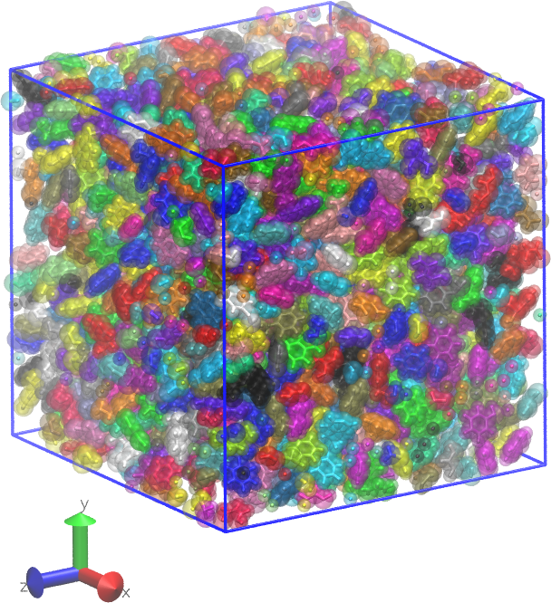

.. _ps_results:

Results
-------

At the end of the run, ``proj-0/systems/final-results/`` contains:

* ``final.gro``, ``final.top``, ``final.tpx``, ``final.grx`` — the
  cured polystyrene system in GROMACS-friendly form;
* ``final.viz.psf``, ``final.viz.tcl`` — VMD-friendly companion files
  that carry the real bond topology and trim PBC-crossing bonds at
  display time.  Open with:

  .. code-block:: console

     $ vmd final.viz.psf final.gro -e final.viz.tcl

   The cured polystyrene box rendered from ``final.viz.psf`` +
   ``final.gro``.  The TCL helper has trimmed bonds that would
   otherwise wrap across the periodic image, leaving each polymer
   chain visually contiguous.

Plots from the build log
^^^^^^^^^^^^^^^^^^^^^^^^

``htpolynet`` writes per-stage trace plots into ``proj-0/plots/`` and a
machine-readable ``proj-0/profile.json`` recording wall time per stage
and subprocess time per tool.  The plotting subcommand can also
produce summary figures from the diagnostic log:

.. code-block:: console

   $ htpolynet plots -diag diagnostics.log

A further exercise
^^^^^^^^^^^^^^^^^^

Copy the YAML and dial down the desired conversion to see what the same
cure looks like at a lower extent of reaction:

.. code-block:: console

   $ cp 1-polystyrene.yaml 1-polystyrene-low.yaml
   $ # edit 1-polystyrene-low.yaml: CURE.controls.desired_conversion: 0.50
   $ htpolynet run -diag diagnostics-low.log 1-polystyrene-low.yaml &> console-low.log &

The second build lands in ``proj-1/``.  Comparing density traces and
the ``profile.json`` files between the two runs gives a feel for how
much of the total wall time goes into the cure loop itself.

Post-build analyses
^^^^^^^^^^^^^^^^^^^

Once you have a cured polystyrene system, ``htpolynet postsim`` and
``htpolynet analyze`` can drive production MD and compute properties
such as the glass-transition temperature.  See the :doc:`postsim`
section for the recommended workflow for this system;
:ref:`pde_tutorial` shows the full set of techniques (including
uniaxial deformation for Young's modulus) with real production-quality
plots.
