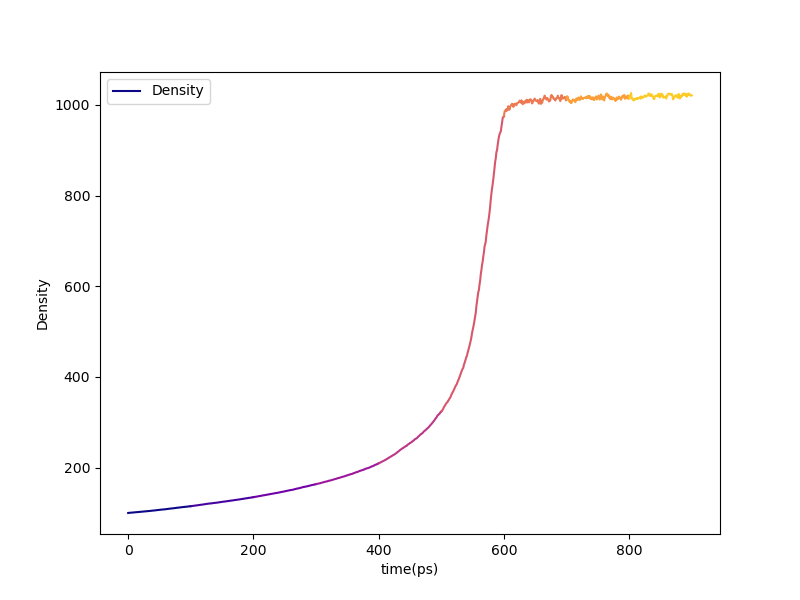
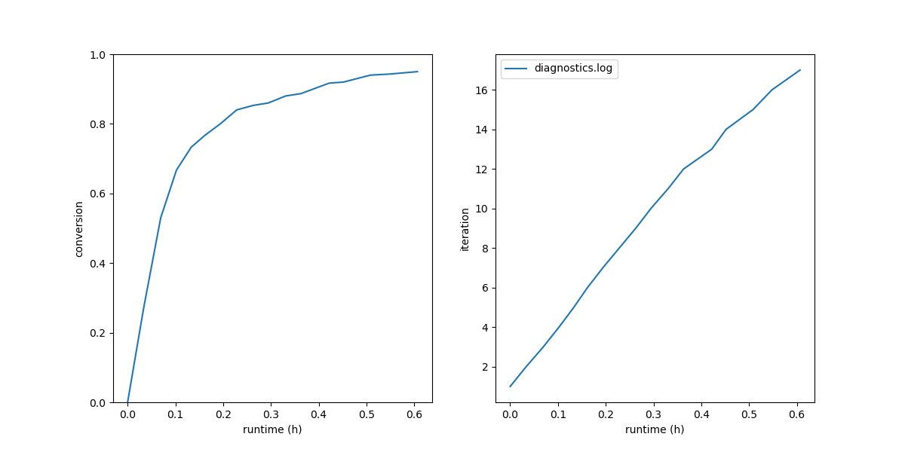
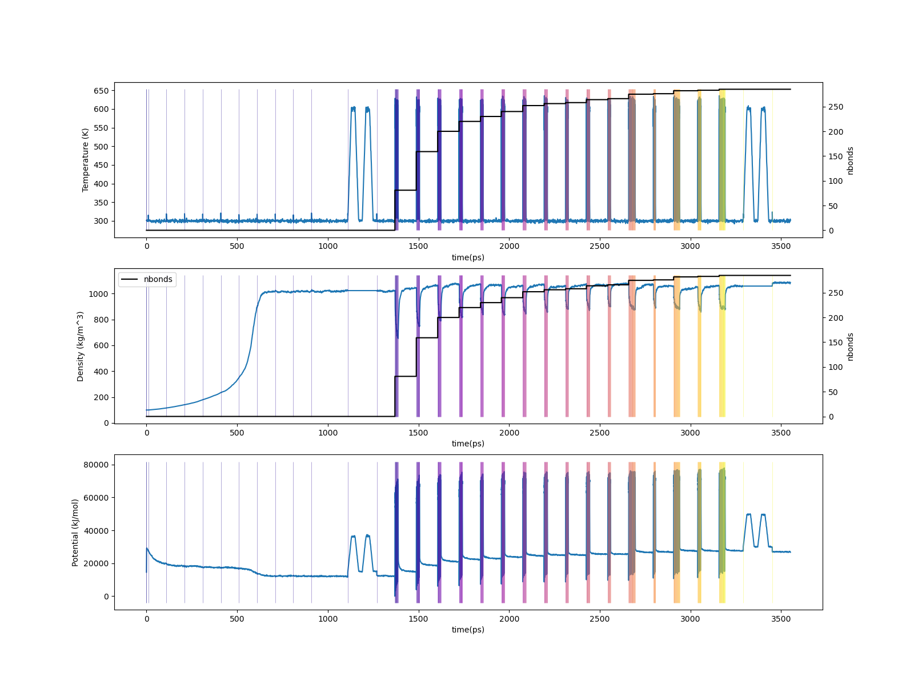

.. _bgs_results:

Results
-------

At the end of the run, ``proj-0/systems/final-results/`` contains the
usual five files (``final.gro``, ``final.top``, ``final.tpx``,
``final.grx``, plus the ``final.viz.psf``/``final.viz.tcl`` pair).
Open with:

.. code-block:: console

   $ vmd final.viz.psf final.gro -e final.viz.tcl

Plots from the build log
^^^^^^^^^^^^^^^^^^^^^^^^

Diagnostic-log plots:

.. code-block:: console

   $ htpolynet plots diag --diags diagnostics.log

   Density vs. time during the densification stage of the bisGMA/STY
   liquid.  Each of the eight 100 ps NPT segments is colored
   distinctly along the ``matplotlib`` ``plasma`` colormap.

   Cure progress vs. wall time and per-iteration bond yield.  Roughly
   75 % of the conversion is reached in the first 25 % of the cure
   wall time — the long tail belongs to the late iterations that pick
   up only a handful of bonds each.

For a full system-build trace from ``edr`` files:

.. code-block:: console

   $ htpolynet plots build --proj proj-0 --buildplot t --traces t d p

This walks every ``edr`` in the project tree and stitches together the
trace; it takes a few minutes on a moderate-sized build.

   Top: temperature vs. time for the 95 % cure of bisGMA/STY.  Middle:
   density vs. time, overlaid with cumulative bond count.  Bottom:
   potential energy vs. time.

Before and after
^^^^^^^^^^^^^^^^

Snapshots of the initial liquid and of the cured system, with all
``C1–C2`` bonds rendered in licorice (intra-monomer in the "before"
panel, intra- + inter-monomer in the "after" panel).  GMA molecules are
mauve, STY are green:

.. list-table::

    * - .. figure:: pics/gma-sty-liq.png

           Liquid before cure.  Each monomer's intra-monomer ``C1–C2``
           single bond is in licorice; cure will convert most of these
           into the network backbone.

      - .. figure:: pics/gma-sty-cured.png

           Cured system.  All ``C1–C2`` bonds (intra and inter) are now
           in licorice; the new C–C inter-monomer bonds are the cure
           crosslinks.

Profile
^^^^^^^

The end-of-run profile report (in ``console.log`` and
``proj-0/profile.json``) shows wall-time and aggregate subprocess time
by stage.  In a build like this the ``setup`` stage is non-trivial
because of all the chain-expansion templates that have to be
parameterized through AmberTools; expect ``antechamber`` and ``tleap``
to take a meaningful share of total wall time alongside ``gmx-mdrun``.