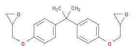
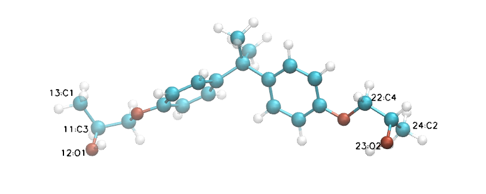
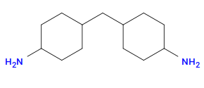
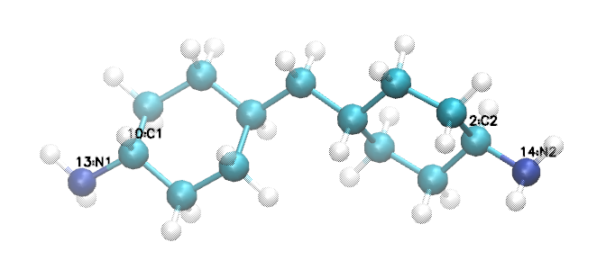

.. _pde_monomers:

Monomers
--------

DGEBA
^^^^^

`Bisphenol A diglycidyl ether
<https://en.wikipedia.org/wiki/Bisphenol_A_diglycidyl_ether>`_ — we keep
the historical abbreviation ``DGEBA`` (residue name ``DGE``) — is
bisphenol A with each phenolic oxygen extended into a glycidyl
(epoxide) group.  The natural SMILES for DGEBA is::

   CC(C)(C1=CC=C(C=C1)OCC2CO2)C3=CC=C(C=C3)OCC4CO4

But ``htpolynet`` needs the **active** form: every reactive atom carries
a sacrificial hydrogen that is deleted when a new bond forms.  For
epoxy-amine chemistry, the amine donates its H to the oxirane oxygen and
the epoxide C–O bond breaks to form the new C–N bond.  So the epoxide
ring has to be pre-opened in our input structure into a methyl +
hydroxyl pair: ``CC(O)`` replaces each oxirane ring.

In SMILES that becomes::

   CC(C)(c1ccc(OC[CH:3]([OH:5])[CH3:1])cc1)c1ccc(OC[CH:4]([OH:6])[CH3:2])cc1

with atom-mapping tokens picking out the four reactive atoms.  This is
exactly what the YAML's ``constituents.DGE`` block contains:

.. code-block:: yaml

   DGE:
     smiles: "CC(C)(c1ccc(OC[CH:3]([OH:5])[CH3:1])cc1)c1ccc(OC[CH:4]([OH:6])[CH3:2])cc1"
     reactive_atoms: {1: C1, 2: C2, 3: C3, 4: C4, 5: O1, 6: O2}
     count: 200
     symmetry_equivalent_atoms: [[C1, C2], [C3, C4], [O1, O2]]
     stereocenters: [C3]

Six atoms get explicit names:

* **C1, C2** — the two reactive carbons (the sacrificial methyls).
  These are the atoms an amine nitrogen will bond to.
* **C3, C4** — the two stereocenters (the carbons bearing the
  hydroxyl).  Opening the oxirane creates a chiral centre; we declare
  ``C3`` and ``htpolynet`` produces the appropriate diastereomer pool
  via ``symmetry_equivalent_atoms``.
* **O1, O2** — the two hydroxyl oxygens.  They get explicit names
  because the cap reaction re-forms an epoxide three-ring (``O–C``
  bond) on any unreacted carbon.

PACM
^^^^

`PACM
<https://en.wikipedia.org/wiki/4,4-Diaminodicyclohexylmethane>`_
(4,4-diaminodicyclohexylmethane, residue name ``PAC``) has two primary
amines, one on each cyclohexyl ring.  Because each amine has two N–H
bonds, each can react twice (with two different epoxides), so a single
PACM can crosslink up to four DGEBAs.  Native SMILES::

   C1CC(CCC1CC2CCC(CC2)N)N

The atom-mapped form (matching the YAML's ``constituents.PAC`` block):

.. code-block:: yaml

   PAC:
     smiles: "C1C[CH:1](CCC1CC2CC[CH:2](CC2)[NH2:3])[NH2:4]"
     reactive_atoms: {1: C1, 2: C1, 3: N1, 4: N1}
     count: 100
     symmetry_equivalent_atoms: [[N1, N2], [C1, C2]]
     stereocenters: [C1]

Both amine carbons are named ``C1`` and both nitrogens are named ``N1``
in ``reactive_atoms`` — the ``symmetry_equivalent_atoms`` block is what
tells ``htpolynet`` to internally relabel the second copies as ``C2`` /
``N2`` so the reactions block can refer to them unambiguously.

The next page describes the :ref:`reaction dictionaries <pde_reactions>`
that drive the cure.
