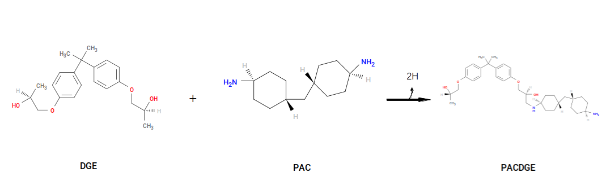
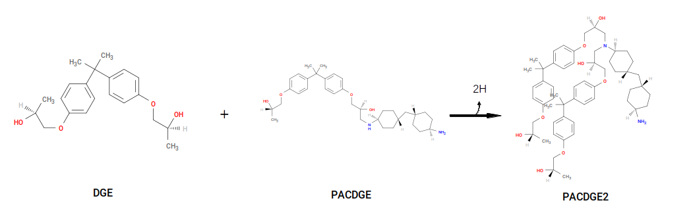
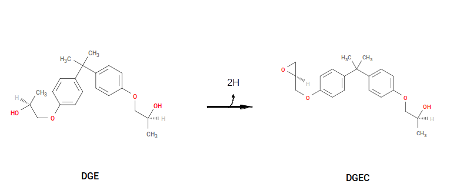

.. _pde_reactions:

Reactions
---------

In a diepoxide + diamine system, the two crosslinking reactions are:

1. **Primary → secondary amine.**  A primary amine on PACM (``-NH₂``)
   reacts with one carbon of an opened oxirane on DGEBA.  One N–H and
   one C–H are sacrificed; a new C–N bond forms.
2. **Secondary → tertiary amine.**  The secondary amine from reaction
   (1) can react again with another DGEBA carbon, forming a tertiary
   amine.

For PACM and DGEBA these are:

The first reaction's product, called ``PAC~N1-C1~DGE``, is itself a
reactant in the second; this is what gives the cure step-growth
character.  Both products serve as parameterization templates:
``PAC~N1-C1~DGE`` provides the local environment around a new secondary
amine, and ``PAC~N1-C1~DGE-C1~DGE`` provides the environment around a
new tertiary amine.  When a CURE bond forms, the atom types, charges,
and bonded interactions in the affected region of the system get mapped
from these templates onto the growing network.

The YAML directive for the primary-to-secondary reaction:

.. code-block:: yaml

   - name:        'Primary-to-secondary-amine'
     stage:       cure
     reactants:
       1: PAC
       2: DGE
     product:     PAC~N1-C1~DGE
     probability: 1.0
     atoms:
       A: {reactant: 1, resid: 1, atom: N1, z: 2}
       B: {reactant: 2, resid: 1, atom: C1, z: 1}
     bonds:
       - atoms: [A, B]
         order: 1

A few things to call out about the syntax:

* ``stage: cure`` says this reaction happens during the iterative CURE
  loop (not capping).
* ``probability: 1.0`` means any candidate bond that survives all other
  filters will always form.
* ``atoms.A.z: 2`` says ``N1`` must have **two** available crosslink
  sites for this reaction to fire — i.e. it must still be a primary
  amine.  After it bonds once, its remaining ``z`` drops to 1 and only
  the next reaction (below) is eligible.
* ``atoms.B.z: 1`` says ``C1`` has only one available crosslink site
  (it has only one sacrificial methyl H), which is consistent with
  forming a single C–N bond per carbon.

The secondary-to-tertiary directive:

.. code-block:: yaml

   - name:        'Secondary-to-tertiary-amine'
     reactants:
       1: PAC~N1-C1~DGE
       2: DGE
     product:     PAC~N1-C1~DGE-C1~DGE
     stage:       cure
     probability: 0.5
     atoms:
       A: {reactant: 1, resid: 1, atom: N1, z: 1}
       B: {reactant: 2, resid: 1, atom: C1, z: 1}
     bonds:
       - atoms: [A, B]
         order: 1

Notes:

* Reactant 1 is now the product of the first reaction
  (``PAC~N1-C1~DGE``) rather than free PAC; the N1 of that residue is
  now a secondary amine with ``z: 1``.
* ``probability: 0.5`` encodes the empirical fact that
  secondary-to-tertiary amine formation is intrinsically slower than
  primary-to-secondary.  Each candidate bond passes a uniform random
  draw against this probability before forming.

Capping
^^^^^^^

After CURE converges, any DGEBA carbon that still has a sacrificial H
left needs to revert to its closed-epoxide form.  The cap reaction:

.. code-block:: yaml

   - name:        'Oxirane-formation'
     reactants:
       1: DGE
     product:     DGEC
     stage:       cap
     probability: 1.0
     atoms:
       A: {reactant: 1, resid: 1, atom: O1, z: 1}
       B: {reactant: 1, resid: 1, atom: C1, z: 1}
     bonds:
       - atoms: [A, B]
         order: 1

This is an intra-monomer bond: ``A`` and ``B`` are both on residue 1 of
reactant 1.  It closes the three-membered C–O–C ring by forming a new
C–O bond between the hydroxyl oxygen and the still-unreacted carbon,
removing the two leftover sacrificial Hs in the process.

With these three directives in place, ``htpolynet`` knows everything it
needs about the chemistry.  The next page covers how
``symmetry_equivalent_atoms`` and ``stereocenters`` interact with these
reactions to produce the full set of templates the runtime actually
uses: :ref:`pde_configuration`.
