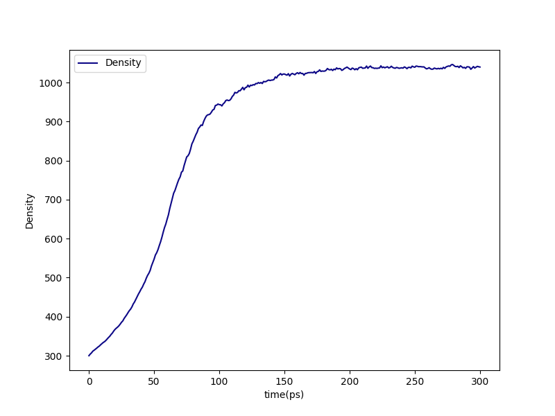
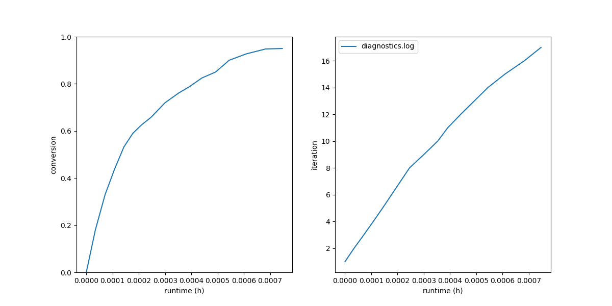
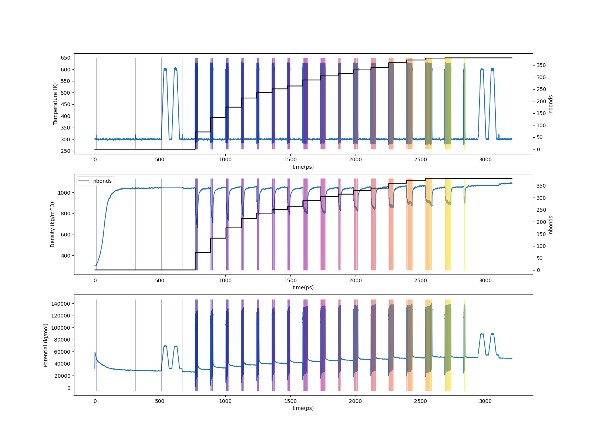

.. _pde_results:

Results
-------

The standard final-results bundle is in
``proj-0/systems/final-results/``:

.. code-block:: console

   $ vmd final.viz.psf final.gro -e final.viz.tcl

Diagnostic-log plots:

.. code-block:: console

   $ htpolynet plots diag --diags diagnostics.log

   Density vs. time during the densification of the DGEBA/PACM liquid.
   With ``initial_density: 300 kg/m³`` and a single 300 ps NPT segment,
   the system reaches roughly ambient polymer density on the first
   pass.

   Left: cure conversion vs. wall-clock.  Right: cure iteration index
   vs. wall-clock.  The shape is typical: ~80 % conversion in the
   first half of the cure wall time, the remaining 20 % takes a
   comparable amount of wall time because the late iterations find
   only a handful of bonds each.

For end-to-end traces from ``edr`` files:

.. code-block:: console

   $ htpolynet plots build --proj proj-0 --buildplot t --traces t d p

   Top: temperature vs. time across the full build (with cumulative
   bond count overlaid).  Middle: density vs. time.  Bottom: potential
   energy vs. time.

Before and after
^^^^^^^^^^^^^^^^

Snapshots of one complete crosslink site (one PACM bonded to four
DGEBAs at all four amine slots) alongside the initial liquid and
the cured network.  Atoms are coloured CPK by element — carbon
grey, nitrogen blue, oxygen red — so the colours in the detail
panel transfer directly to the bulk views.  In the bulk panels the
amine→epoxide chemistry atoms (PAC ``N1``/``N2``, DGE ``C1``/``C2``,
hydroxyl carbons, and DGE oxygens) are drawn in thick CPK Licorice
on a faded grey lines background, so the crosslink sites stand out
from the DGEBA carrier mass:

.. list-table::

    * - .. figure:: pics/dge-pac-detail.png

           One complete crosslink: one PACM bonded to four DGEBAs at
           both amine slots of each nitrogen.

      - .. figure:: pics/dge-pac-liq.png

           System before cure.

      - .. figure:: pics/dge-pac-cured.png

           System after cure.

Profile
^^^^^^^

The end-of-run profile (in ``console.log`` and
``proj-0/profile.json``) shows where the wall time went.  In a typical
DGEBA/PACM run, expect:

* ``setup`` (parameterization of 22 templates) consumes a meaningful
  share — antechamber + tleap dominate this stage;
* ``cure`` iterations themselves are dominated by ``gmx-mdrun`` for the
  per-iteration relax + equilibrate cascades;
* ``capping`` is fast (single iteration over the ~20 leftover oxiranes).

Comparing ``profile.json`` between a run with
``CURE.controls.min_bonds_per_iteration: 1`` and the default
``min_bonds_per_iteration: 10`` is a useful way to see how the knob
trades iteration count for batch size (the iteration counts measured
on this system are tabulated in :ref:`pde_run`).
