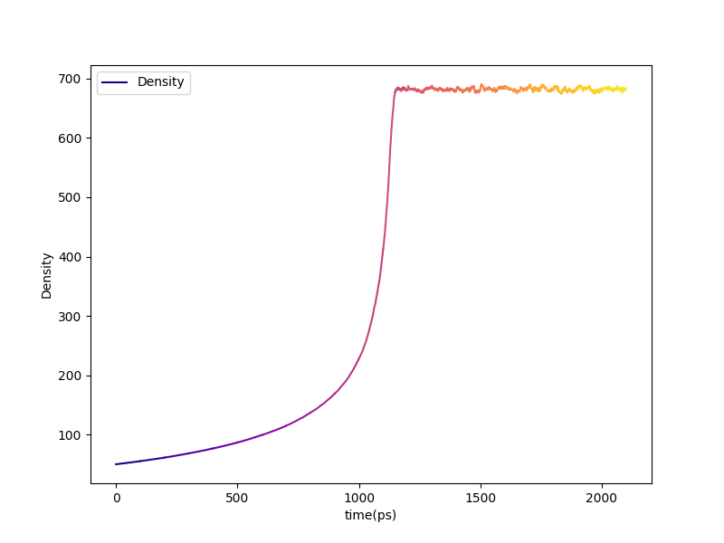
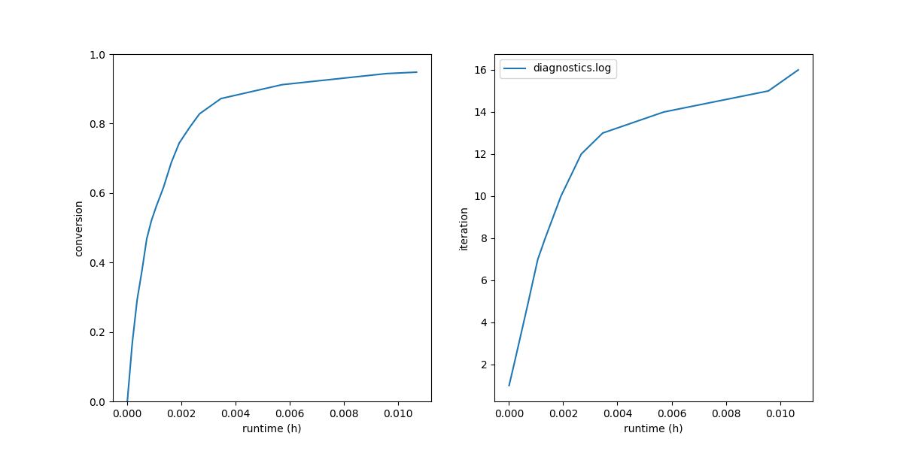
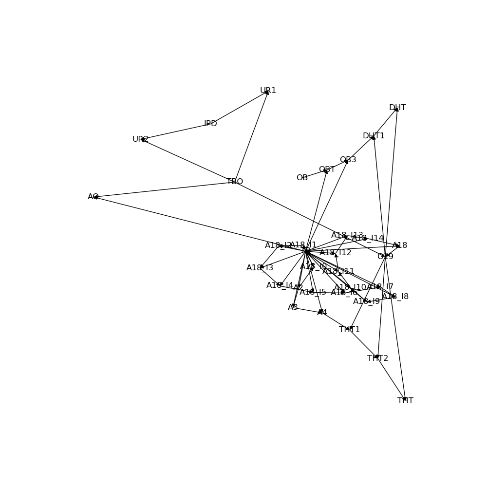
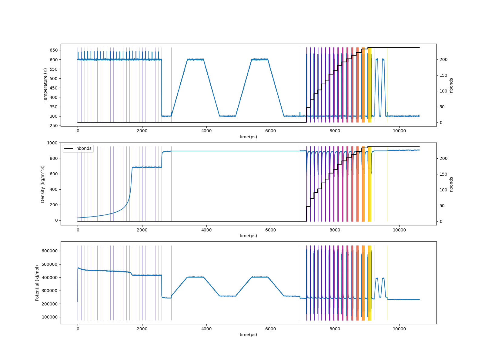

.. _htpb_results:

Results
-------

The standard final-results bundle is in
``proj-0/systems/final-results/``:

.. code-block:: console

   $ vmd final.viz.psf final.gro -e final.viz.tcl

Diagnostic-log plots:

.. code-block:: console

   $ htpolynet plots diag --diags diagnostics.log

   Density vs. time during densification.  The 25 NPT repeats at
   600 K / 10 bar progressively compact the system from
   ``initial_density: 30 kg/m³`` into a near-melt density around
   0.9 g/cm³.  The staircase shape is one step per repeat; the
   slope flattens as the chains finish interpenetrating.

   Left: cure conversion vs. wall-clock.  Right: cure iteration
   index vs. wall-clock.  Notice how the rightmost portion of the
   left plot rises slowly — half the wall time is spent on the
   final ~10 % conversion.  This is the cure-tail effect; the
   late-iteration ``cure_drag`` steps dominate as remaining
   hydroxyl / isocyanate pairs become scarce.

   The final bond network.  Each IPD node connects to two HTPB
   chain-end ``TBO`` residues; HTPB chains are the long backbones
   of OB + TB + TBO nodes.

For end-to-end traces:

.. code-block:: console

   $ htpolynet plots build --proj proj-0 --buildplot t --traces t d p

   Top: temperature vs. time (cumulative bond count overlaid).
   Middle: density vs. time.  Bottom: potential energy vs. time.
   The visible "shelves" in the density trace correspond to the 25
   densification repeats; the postcure anneal segments dominate
   the right edge.

Before and after
^^^^^^^^^^^^^^^^

Snapshots of one complete urethane crosslink site (one IPDI tethered
to two HTPB chain ends) alongside the densified liquid and the cured
network.  Atoms are coloured CPK by element — carbon grey, nitrogen
blue, oxygen red — so the colours in the detail panel transfer
directly to the bulk views.  In the bulk panels the polybutadiene
backbone (``TB`` residues) is hidden — ex 5's crosslink density is
so low that drawing the matrix swamps the urethane sites visually —
and only the IPDI crosslinkers (``IPD``) and HTPB chain end-groups
(``TBO``) are rendered, in thick CPK Licorice:

.. list-table::

    * - .. figure:: pics/htpb-ipdi-detail.png

           One complete crosslink: one IPDI bonded to two HTPB chain
           ends via urethane bonds.

      - .. figure:: pics/htpb-ipdi-liq.png

           System before cure: densified liquid of HTPB chains and
           free IPDs.

      - .. figure:: pics/htpb-ipdi-cured.png

           System after cure: IPDs bridge HTPB chain ends via
           urethane bonds, forming a sparse 3D network.

Residue census
^^^^^^^^^^^^^^

On the representative run logged above (95 % cure, 238 / 250
urethane bonds):

.. list-table::
   :header-rows: 1
   :widths: 30 30 40

   * - Residue
     - Atom count
     - Source
   * - ``IPD``
     - 4512
     - 125 IPD × ~36 atoms (after cure-stage H losses).
   * - ``TB``
     - 47950
     - Repeat units in DHT and THT chains.
   * - ``TBO``
     - 2762
     - Chain end-caps (the hydroxyl-bearing terminators).
   * - ``OB``
     - 500
     - Chain initiators (one per DHT / THT chain).
   * - **Total**
     - **55,724**
     - 50 DHT + 50 THT + 125 IPD = 225 monomers, ~56k atoms.

Profile interpretation
^^^^^^^^^^^^^^^^^^^^^^

The end-of-run profile (in ``console.log`` and
``proj-0/profile.json``) shows where the wall time went.  In a
typical HTPB/IPDI run:

* ``setup`` is comparatively brief (~30 seconds) given the large
  number of templates — conformer generation is the dominant cost,
  not antechamber, because the small HTPB sub-units parameterize
  quickly.
* ``densification`` and ``precure`` together consume ~3 hours.  The
  long initial-densification (25 NPT repeats) is the dominant
  precure cost.
* ``cure`` dominates the total at ~75 % of wall-clock.  The
  per-iteration breakdown above shows the late-iteration cost growth
  vividly — iteration 15 alone is more than half the total cure
  time.
* ``capping`` and ``postcure`` are short by comparison.

A useful tuning experiment: rerun with
``CURE.controls.min_bonds_per_iteration: 1`` to see what happens
without batching.  The expected outcome is *more* iterations, *each*
mostly spent in ``cure_drag`` looking for the last few pairs, with
total wall-time roughly the same or longer.  Conversely, raising
``min_bonds_per_iteration`` to 20+ would consolidate the tail but
make individual iterations even slower as the drag distances grow.

The next page covers the postsim + analyze workflow, which follows
the canonical pattern documented in :ref:`tutorial 3
<tutorials_postsim_analyses>`.
