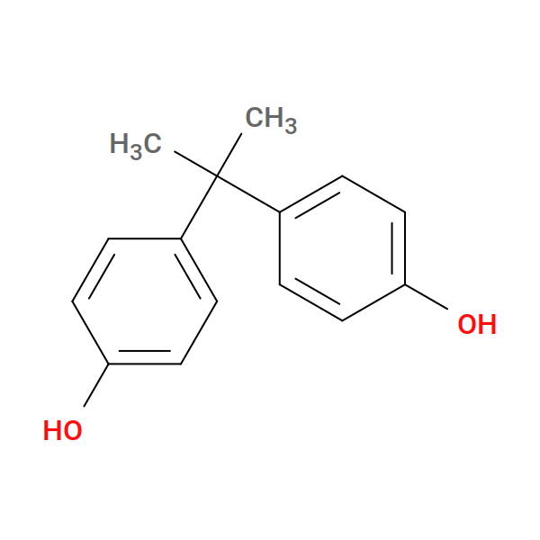

.. _badcy_monomers:

Monomers
--------

Three constituents:

* **BPA** — bisphenol-A, the difunctional bridge.  Identical to the
  BPA used in :ref:`example 2 <bgs_tutorial>` (the bisGMA + styrene
  thermoset) — two phenolic ``-OH`` groups, each reactive on its
  oxygen.
* **TAZ** — bare 1,3,5-triazine, the trifunctional crosslinker.
  Three reactive ring C-H positions, alternating with three ring
  nitrogens.
* **CYN** — hydrogen cyanide (``H-C#N``).  *Not* placed in the
  simulation box; only exists so the linked-product template
  ``BPA~O1-C1~CYN`` can be auto-generated at setup time for the
  postcure repair stage.

BPA
^^^

Bisphenol-A — two phenol rings joined by a central isopropylidene
carbon, two reactive phenolic ``-OH`` groups:

The SMILES (the same as example 2's BPA):

.. code-block:: yaml

   BPA:
     smiles: "CC(c1ccc([OH:1])cc1)(c1ccc([OH:2])cc1)C"
     reactive_atoms: {1: O1, 2: O2}
     count: 360
     symmetry_equivalent_atoms: [[O1, O2]]

* ``O1, O2`` — the two reactive phenolic oxygens.  Each will lose its
  H to form an aryl ether bond with a triazine ring carbon during
  cure, and any O that doesn't react during cure has its H replaced
  by a ``-C#N`` cap during postcure repair.
* ``symmetry_equivalent_atoms: [[O1, O2]]`` declares the two oxygens
  chemically equivalent so the single ``etherify`` reaction in the
  YAML auto-expands into both ``BPA.O1`` and ``BPA.O2`` variants.

TAZ
^^^

`1,3,5-triazine
<https://en.wikipedia.org/wiki/1,3,5-Triazine>`_ — a six-membered
aromatic ring with three carbons and three nitrogens at alternating
positions.

.. admonition:: Placeholder
   :class: caution

   **TODO:** insert a 2D structure render at ``pics/TAZ.png``.

The atom-mapped SMILES:

.. code-block:: yaml

   TAZ:
     smiles: "[cH:1]1[n:4][cH:2][n:5][cH:3][n:6]1"
     reactive_atoms: {1: C1, 2: C2, 3: C3, 4: N1, 5: N2, 6: N3}
     count: 240
     symmetry_equivalent_atoms: [[C1, C2, C3], [N1, N2, N3]]

A few things to call out:

* **All six ring atoms are atom-mapped**, even though only the carbons
  are *reactive*.  The nitrogens get unique names ``N1``, ``N2``,
  ``N3`` because the postcure repair driver refers to them by name
  when dismantling incomplete rings (each ring C gets paired with one
  of its adjacent ring N atoms to make a ``-C#N`` cap).  Without
  atom-mapping, antechamber would name all three nitrogens just
  ``N``, and the repair driver couldn't tell them apart.
* The three carbons are symmetry-equivalent (``C1``, ``C2``, ``C3``);
  so are the three nitrogens.  Each ``symmetry_equivalent_atoms``
  group can have any number of members — these are the first
  three-member groups in any depot example.
* The single ``etherify`` reaction below references ``TAZ.C1``; the
  symmetry-expander generates the ``C2`` and ``C3`` variants
  automatically.

3:2 stoichiometry
^^^^^^^^^^^^^^^^^

360 BPA × 2 reactive O = 720 reactive sites; 240 TAZ × 3 reactive C =
720 reactive sites.  At full conversion (which we don't actually reach
— see the run page), every BPA-O is bonded to a triazine ring C, every
triazine carbon is bonded to a BPA-O, and the network is fully
crosslinked with triazine trifunctional nodes and BPA bridges.

CYN
^^^

The third constituent is hydrogen cyanide:

.. code-block:: yaml

   CYN:
     smiles: "[CH:1]#[N:2]"
     reactive_atoms: {1: C1, 2: N1}

No ``count:`` is set, so CYN is never inserted into the simulation
box.  Its role is purely as a **parameterization template** for the
``-C#N`` end group that the postcure repair stage attaches to BPA-O
atoms.  The :ref:`reactions page <badcy_reactions>` covers how a
``repair``-stage reaction definition referencing CYN auto-generates a
parameterized ``BPA~O1-C1~CYN`` linked-product template, which the
repair driver then splices into the system topology for every cap it
forms.

Both atoms of CYN are atom-mapped so the template's nitrogen lands in
the mol2 with the name ``N1`` (not the default element-only ``N``);
again, the repair driver looks up cap atoms by name, so the template
and the system have to agree.

The next page walks through the :ref:`reactions <badcy_reactions>`.
