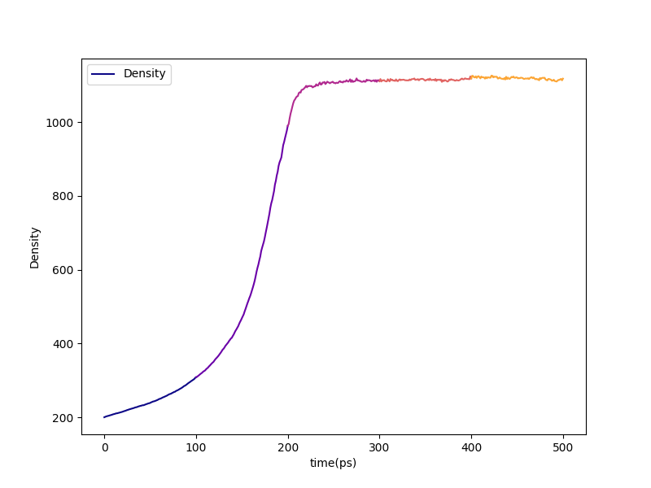
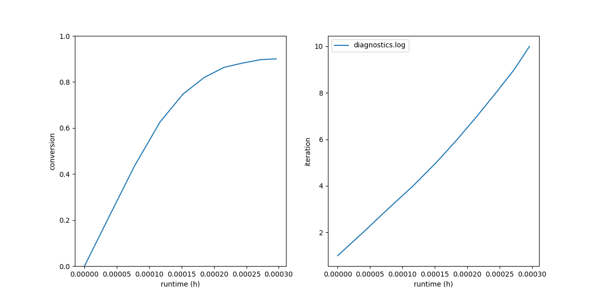
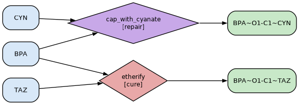
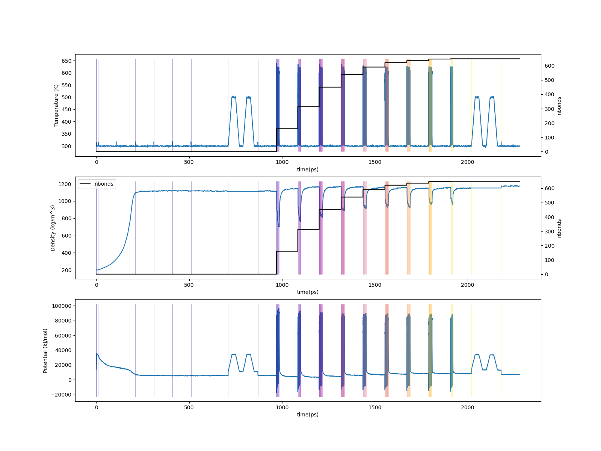

.. _badcy_results:

Results
-------

The standard final-results bundle is in
``proj-0/systems/final-results/``:

.. code-block:: console

   $ vmd final.viz.psf final.gro -e final.viz.tcl

Diagnostic-log plots:

.. code-block:: console

   $ htpolynet plots diag --diags diagnostics.log

   Density vs. time during densification of the BPA + 1,3,5-triazine
   liquid.  With ``initial_density: 200 kg/m³`` the system reaches
   roughly 0.9-1.0 g/cm³ after the four 100 ps NPT segments — a touch
   below typical polymer density because the unreacted starting state
   carries free triazine and free BPA-OH that don't pack tightly.

   Left: cure conversion vs. wall-clock.  Right: cure iteration index
   vs. wall-clock.  90 % conversion in 9 iterations; the long-tail
   shape is sharper than the DGEBA/PACM example because the A2+B3
   step-growth on a 3:2 stoichiometry runs out of nearby reactive
   pairs faster than the diepoxide-amine system does.

   The final bond network as a graph.  Triazine residues that ended
   up fully bonded (k=3) appear as 3-degree nodes; ones that ended up
   with k<3 are the ones the postcure repair stage subsequently
   dismantled.

.. warning::

   The 90 % above is a **bond** conversion, and it is not the number
   this structure would be reported as in an experiment.  Repair
   dismantles every triazine that did not fill all three of its
   sites, so what survives is complete triazines plus unreacted
   cyanate — and the fraction of triazines that survive is what FTIR
   measures at 2270 cm\ :sup:`-1`.  Under random placement that
   fraction is about the cube of the bond conversion, so a run at
   0.90 leaves a cyanate conversion near 0.73 -- a little above it
   here, since this cure takes nine iterations and the distance-ranked
   search keeps re-finding crosslinkers that are partly bonded.  The
   cube is an estimate rather than a bound: at five to eight iterations
   real runs scatter a few percent either side of it.  A cure that
   reaches its target in two or three iterations lands far below it,
   and in fewer than three it lands at exactly zero, because at most
   one bond per residue forms per iteration.  htpolynet reports
   both figures at the end of the repair stage and writes them to
   ``repair-summary.yaml``; see :ref:`what repair reports
   <postcure_repair_reporting>`.  If what you want is a structure
   that really is 90 % converted, see the
   ``CURE.controls.completion_bias`` directive.

For end-to-end traces:

.. code-block:: console

   $ htpolynet plots build --proj proj-0 --buildplot t --traces t d p

   Top: temperature vs. time across the full build (cumulative bond
   count overlaid).  Middle: density vs. time.  Bottom: potential
   energy vs. time.  The flat-temperature postcure-anneal segments
   between 300 K and 500 K dominate the right end of the trace.

Before and after
^^^^^^^^^^^^^^^^

Snapshots of one complete crosslink site (a fully-formed triazine
bonded to three bisphenol-A bridges) alongside the densified liquid
and the cured + repaired network.  Atoms are coloured CPK by
element — carbon grey, nitrogen blue, oxygen red — so the colours
in the detail panel transfer directly to the bulk views.  In the
bulk panels the BPA phenolic oxygens (``O1``, ``O2``), the triazine
ring atoms, and the post-repair ``CYN`` cap atoms are drawn in
thick CPK Licorice on a faded grey lines background, so the new
inter-residue cure bonds stand out from the BPA carrier mass.  The
detail panel is rotated so the triazine ring normal is along the
view direction (face-on).

.. list-table::

    * - .. figure:: pics/badcy-detail.png

           One complete crosslink: one fully-formed triazine bonded
           to three BPAs at its three ring carbons, viewed face-on.

      - .. figure:: pics/badcy-liq.png

           System before cure: densified liquid of BADCy monomers,
           no inter-monomer cure bonds yet.

      - .. figure:: pics/badcy-cured.png

           System after cure + repair: BPA-O atoms tie the triazine
           ring junctions together with ``CYN`` caps interspersed
           where the post-repair cap converted unreacted reactive
           sites.

Residue census
^^^^^^^^^^^^^^

On the representative run logged above (90 % cure, 57 incomplete
triazines, 100 in-place caps + 71 free caps):

.. list-table::
   :header-rows: 1
   :widths: 30 30 40

   * - Residue
     - Count
     - Source
   * - ``BPA``
     - 360
     - All 360 input BPAs survive (no monomer-level deletion).
   * - ``TAZ``
     - 183
     - The 240 - 57 = 183 triazines that reached k=3 during cure.
   * - ``CYN``
     - 171
     - 57 dismantled rings × 3 -C#N fragments = 171 cap residues.

Atom conservation is exact: every C and N atom of every dismantled
triazine ends up in exactly one ``CYN`` residue, and the only atoms
deleted are the (3-k) × 2 sacrificial H atoms per dismantled ring (one
per dangling ring C, plus one per donated free cap's BPA-O target).

Profile
^^^^^^^

The end-of-run profile (in ``console.log`` and
``proj-0/profile.json``) shows where the wall time went.  In a typical
BADCy run, expect:

* ``setup`` is fast (only 11 templates to parameterize, all small
  molecules);
* ``precure`` is a meaningful share (~3-4 min) because of the long
  preequilibration + anneal block;
* ``cure`` dominates (~75 % of wall time) — same shape as any
  step-growth example;
* ``repair`` adds about a minute: the topology surgery itself is fast
  (~5 s), the rest is the post-surgery minimization + 5 ps NVT
  settle;
* ``postcure`` is one anneal cycle + a 100 ps NPT.

A useful diagnostic: ``grep "incomplete TAZ" diagnostics.log`` reports
the count of dismantled triazines and the in-place / free-fragment
split, which together with the residue census above tell you how
"complete" the topological network was just before the repair stage
ran.

The next page covers the same kind of postsim + analyze workflow
documented for :ref:`tutorial 3 <pde_postsim>`.
