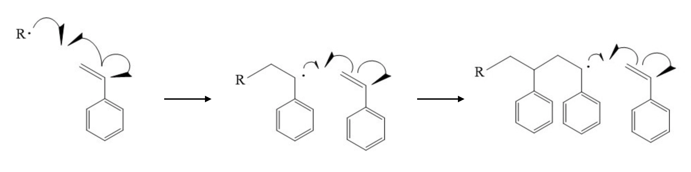
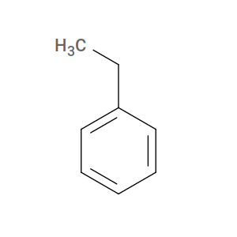

.. _ps_monomer:

Monomer: Styrene
----------------

.. _fig_sty_polym:

    Polymerization of styrene via carbon-carbon double-bond opening.

`Styrene <https://pubchem.ncbi.nlm.nih.gov/compound/styrene>`_ polymerizes by radical addition: the carbon-carbon double bond opens so that each radical carbon bonds to a radical carbon on an adjacent monomer (:numref:`fig_sty_polym`).  ``htpolynet`` must be able to distinguish the two vinyl carbons, which we will call ``C1`` (the internal, phenyl-bearing carbon) and ``C2`` (the terminal methylene carbon).

**Valence-conservation and the active form**

As described in the :ref:`user guide <molecular_structure_inputs>`, ``htpolynet`` requires each reactive atom to carry a *sacrificial hydrogen* that is deleted when a new bond forms.  The "inactive" form of styrene has a C=C double bond:

.. figure:: pics/STYCC.png
   :scale: 50 %

   Styrene (inactive form).

The **active** form we actually supply to ``htpolynet`` is ethylbenzene, which carries two extra hydrogens on what will become the reactive carbons:

   Ethylbenzene (active form of styrene, monomer name ``STY``).

**Generating the mol2 file**

The ``1-polystyrene.sh`` script uses ``obabel`` and the `SMILES <https://en.wikipedia.org/wiki/Simplified_molecular-input_line-entry_system>`_ string for ethylbenzene to generate a 3-D structure and rename the two reactive carbons:

.. code-block:: console

    $ obabel -:"C1=CC=CC=C1CC" -ismi -omol2 -h --gen3d --title styrene-active \
        | sed s/" 7 C "/" 7 C1"/ \
        | sed s/" 8 C "/" 8 C2"/ \
        | sed s/"UNL1"/"STY "/ > lib/molecules/inputs/STY.mol2

The resulting file :download:`STY.mol2 <files/STY.mol2>` looks like this::

    @<TRIPOS>MOLECULE
    STY
     18 18 0 0 0
    SMALL
    GASTEIGER

    @<TRIPOS>ATOM
          1 C          -0.7006    1.1795   -0.0272 C.ar    1  STY        -0.0586
          2 C           0.6928    1.2166    0.0538 C.ar    1  STY        -0.0615
          3 C           1.4223    0.0286    0.0810 C.ar    1  STY        -0.0617
          4 C           0.7581   -1.1951    0.0377 C.ar    1  STY        -0.0615
          5 C          -0.6353   -1.2335   -0.0439 C.ar    1  STY        -0.0586
          6 C          -1.3772   -0.0454   -0.0907 C.ar    1  STY        -0.0476
          7 C1         -2.8796   -0.0869   -0.2079 C.3     1  STY        -0.0305
          8 C2         -3.5705   -0.1623    1.1447 C.3     1  STY        -0.0613
          9 H          -1.2556    2.1152   -0.0496 H       1  STY         0.0620
         10 H           1.2096    2.1715    0.0912 H       1  STY         0.0618
         11 H           2.5068    0.0578    0.1356 H       1  STY         0.0618
         12 H           1.3256   -2.1221    0.0620 H       1  STY         0.0618
         13 H          -1.1387   -2.1963   -0.0798 H       1  STY         0.0620
         14 H          -3.1733   -0.9486   -0.8199 H       1  STY         0.0311
         15 H          -3.2298    0.7998   -0.7503 H       1  STY         0.0311
         16 H          -3.2680   -1.0573    1.6981 H       1  STY         0.0233
         17 H          -4.6567   -0.1988    1.0102 H       1  STY         0.0233
         18 H          -3.3353    0.7117    1.7611 H       1  STY         0.0233
    @<TRIPOS>BOND
         1     1     2   ar
         2     2     3   ar
         3     3     4   ar
         4     4     5   ar
         5     5     6   ar
         6     1     6   ar
         7     6     7    1
         8     7     8    1
         9     1     9    1
        10     2    10    1
        11     3    11    1
        12     4    12    1
        13     5    13    1
        14     7    14    1
        15     7    15    1
        16     8    16    1
        17     8    17    1
        18     8    18    1

Atoms 7 and 8 (``mol2`` index) are now named ``C1`` and ``C2`` respectively.  All other atoms keep generic names; only the atoms that ``htpolynet`` must track by name need to be uniquely labelled.

The next thing we consider is how to create the :ref:`reaction dictionaries <ps_reactions>` that describe the polymerization chemistry.
