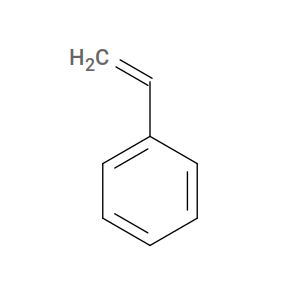

.. _molecular_structure_inputs:

Molecular Structure Inputs
--------------------------

``htpolynet`` requires a molecular structure for every monomer (and any other small molecule) that appears in your system.  It recognizes ``mol2`` and ``pdb`` formats, and consumes them from ``./lib/molecules/inputs/`` relative to the directory in which you run ``htpolynet run`` or ``htpolynet parameterize``.  You can either let ``htpolynet`` generate these files for you from `SMILES <https://en.wikipedia.org/wiki/Simplified_molecular-input_line-entry_system>`_ strings written directly into your configuration file (the recommended path, described next), or supply hand-prepared ``mol2``/``pdb`` files yourself (covered last).  Either way, two **very important** considerations apply.

Before either path: valence conservation
^^^^^^^^^^^^^^^^^^^^^^^^^^^^^^^^^^^^^^^^

``htpolynet`` requires **valence-conservation** when polymerizing.  When two atoms are identified as bonding partners (each typically on a separate molecule), each must own at least one **sacrificial hydrogen** that is deleted when the new bond forms, keeping the valence of each atom constant.  We refer to this form of a monomer as its **active** form — and it is the active form that you describe to ``htpolynet``, not the "actual" textbook form.

To illustrate, consider styrene.  The "inactive" form is its actual structure:

For ``htpolynet``, however, styrene's **active** form is ethylbenzene:

.. image:: pics/STY.png

So the SMILES (or ``mol2``) you give to ``htpolynet`` for styrene must describe ethylbenzene, with the two reactive carbons saturated and carrying the sacrificial hydrogens that will be removed when the inter-monomer bond forms.

In-config SMILES (recommended)
^^^^^^^^^^^^^^^^^^^^^^^^^^^^^^

The simplest way to supply a monomer is to write its SMILES string directly into your configuration file inside the ``constituents`` block.  ``htpolynet`` generates a 3-D structure, writes the ``mol2`` to ``lib/molecules/inputs/<NAME>.mol2``, and proceeds as if you had supplied the file by hand.  Two paths are supported.

* **RDKit atom-mapping path** (recommended; requires `RDKit <https://www.rdkit.org/>`_).  Encode reactive atoms inline with SMILES atom-map labels (``[CH2:1]``) and a ``reactive_atoms`` map keyed by those labels::

    constituents:
      STY:
        smiles: "c1ccccc1[CH2:1][CH3:2]"
        reactive_atoms: {1: C1, 2: C2}

  This identifies the reactive atoms by chemical identity rather than by mol2 index, so the spec is robust to changes in atom ordering between toolchain versions.  RDKit is a required runtime dependency of ``htpolynet`` and is pulled in automatically by ``pip install htpolynet`` / ``uv pip install -e .`` / the container image.

  .. warning::

     SMILES bracket atoms (``[...]``) take an **explicit** hydrogen count.  ``[C:1]`` means *zero implicit H* — the carbon stays at its explicit valence.  For an sp³ carbon you almost always want ``[CH:1]`` (one implicit H) or ``[CH2:1]`` / ``[CH3:1]`` as appropriate.  Mis-specified hydrogen counts typically show up as antechamber typing a saturated carbon as ``c2`` instead of ``c3``, propagating into a missing GAFF angle parameter in ``tleap``.

* **OpenBabel index path** (no Python extras).  Provide ``smiles`` and a ``rename_atoms`` map keyed by 1-based mol2 atom index::

    constituents:
      STY:
        smiles: "C1=CC=CC=C1CC"
        rename_atoms: {7: C1, 8: C2}

  You need to know which ``obabel``-emitted indices to rename, which usually means running ``obabel`` once by hand to inspect the atom order.

In both cases ``htpolynet`` shells out to ``obabel`` to produce the final ``mol2`` (RDKit itself has no mol2 writer), so `OpenBabel <https://openbabel.org/wiki/Main_Page>`_ must be on your ``PATH``.  See :doc:`/install` for setup details.

If a ``lib/molecules/inputs/<NAME>.mol2`` is already present, it is left alone and SMILES regeneration is skipped — hand-edits survive a re-run.  Delete the file to force regeneration.

Supplying mol2 or pdb files directly
^^^^^^^^^^^^^^^^^^^^^^^^^^^^^^^^^^^^

If SMILES cannot cleanly capture your monomer (e.g., unusual stereochemistry, charged species, or coordinates from a published source), you can place a hand-prepared ``mol2`` or ``pdb`` into ``lib/molecules/inputs/`` directly.  Two common ways to produce one:

* **Sketch and export.**  Any 2-D chemical sketcher that exports ``mol2`` will work.  For example, the `ChemDoodle 2D sketcher <https://web.chemdoodle.com/demos/2d-sketcher>`_:

  .. figure:: pics/chemdoodle-2dsketcher-emb.png

      Example of a ChemDoodle 2D-sketcher session for creating an input ``mol2`` file for styrene (well, actually ethylbenzene).

* **Standalone obabel.**  Write the SMILES on the command line and let ``obabel`` produce a 3-D structure:

  .. code-block:: console

      $ obabel -:"C1=CC=CC=C1CC" -ismi --gen-3d -h -omol2 -O STY.mol2

With either of these, you are responsible for editing atom names yourself (see below) before ``htpolynet`` can reference them.

Atom-naming
^^^^^^^^^^^

``htpolynet`` expects every atom it must reference (i.e., every reactive atom) to have a **unique name** within its monomer.  The names themselves don't matter, only their uniqueness; non-reactive atoms can be left at their default names.  The in-config SMILES paths handle this naming automatically via ``rename_atoms`` / ``reactive_atoms``.  For hand-prepared ``mol2``/``pdb`` files, you must edit the atom-name field yourself.  Several atom-naming conventions are demonstrated in the :ref:`tutorials <example_tutorials>`.
